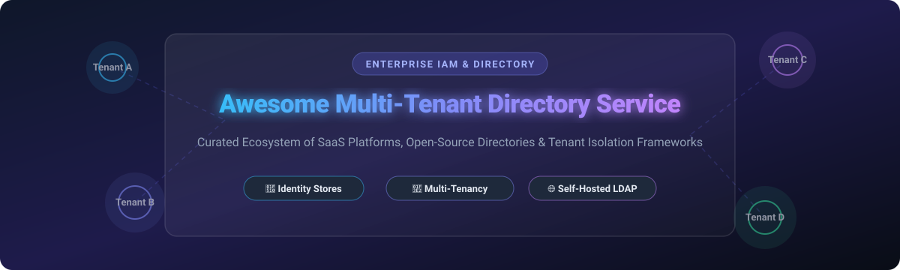

  

      

<h1 align="center">🌟 Awesome Multi-Tenant Directory Service</h1>

  <strong>Curated Directory of Commercial SaaS Products, Open-Source Identity Providers, LDAP Servers &amp; Tenant Isolation Frameworks</strong>

  <em>A comprehensive architectural resource for Platform Engineers, SaaS Founders, Security Architects, and DevOps Teams.</em>

---

## 📌 Table of Contents

- [💡 Overview &amp; Key Concepts](#-overview--key-concepts)
- [📊 Market Overview &amp; Industry Dynamics](#-market-overview--industry-dynamics)
- [🏢 Commercial SaaS Directory Platforms](#-commercial-saas-directory-platforms)
- [🌐 Open-Source GitHub Projects](#-open-source-github-projects)
- [❓ Frequently Asked Questions (FAQ)](#-frequently-asked-questions-faq)
- [🤝 How to Contribute](#-how-to-contribute)
- [💖 Support &amp; Sponsorship](#-support--sponsorship)
- [⚠️ Disclaimer &amp; Security Considerations](#%EF%B8%8F-disclaimer--security-considerations)
- [📈 Star History](#-star-history)

---

## 💡 Overview & Key Concepts

A **Multi-Tenant Directory Service** is the core identity foundation that enables organizations to store, manage, and isolate user identities, groups, permissions, and corporate hierarchies across multiple distinct customers (tenants). 

Whether building a **B2B SaaS application**, establishing **enterprise identity governance (IGA)**, or deploying a **federated single sign-on (SSO)** network, selecting the right directory architecture is critical for compliance (GDPR, SOC 2, HIPAA), scalability, and security.

### 🔑 Core Pillars of Multi-Tenant Directory Architecture:
- 🏢 **Tenant Isolation Boundaries**: Segmenting data using separate databases, distinct schemas, or logical organization identifiers (e.g., Keycloak Realms, Zitadel Organizations, Authentik Brands).
- 🔄 **SCIM 2.0 Provisioning**: Automating user onboarding and offboarding synchronization between identity providers (IdP) and client directories.
- 🔑 **Federated Authentication & SSO**: Standardizing enterprise logins via OpenID Connect (OIDC), SAML 2.0, and OAuth 2.0 protocols.
- 🛡️ **Fine-Grained Access Control (FGAC)**: Enforcing Relationship-Based Access Control (ReBAC / Google Zanzibar) or Role-Based Access Control (RBAC) across tenants.

---

## 📊 Market Overview & Industry Dynamics

> **📈 Sector Growth & Size**: The global **Identity and Access Management (IAM) & Multi-Tenant Directory Services** market is valued at **$18.5 Billion to $22.5 Billion in 2026** and is projected to expand to **$35+ Billion by 2030** (~14% CAGR).
>
> **🧩 Market Structure**: The sector is **moderately fragmented**. Global hyperscalers (*Microsoft Entra ID, AWS*) dominate core enterprise infrastructure, while specialized cloud identity leaders (*Okta, Ping Identity, JumpCloud*) and modern B2B SaaS platforms (*WorkOS, Frontegg*) serve product-led growth and developer integration needs.

---

## 🏢 Commercial SaaS Directory Platforms

*Ranked by Company Size / Valuation (Descending)*

| 🏢 Product / Platform | 💰 Company Size (Valuation / Revenue) | 🏷️ Starting Price | 🎁 Free Tier / Trial Limits | 🚀 Description & Key Capabilities |
| :--- | :--- | :--- | :--- | :--- |
| **[Microsoft Entra ID](https://www.microsoft.com/en-us/security/business/identity-access/microsoft-entra-id)** | **$3.1 Trillion** (Market Cap) / $245B+ Revenue | **$6.00 / user / month** (P1 tier) | Free up to 50,000 MAUs for External Identities; 500k object limit on core Free tier | De facto enterprise identity standard with multi-tenant directory, B2B collaboration, conditional access, and 10,000+ app integrations. |
| **[AWS Cloud Directory](https://aws.amazon.com/clouddirectory/)** | **$2.1 Trillion** (Market Cap) / $600B+ Revenue | **$0.25 / GB-month** + $0.0025 per 10k reads | Free Tier includes 1 GB storage & 10,000 read/write operations/month for 12 months | Fully managed, highly scalable hierarchical data store with multi-tenant schema-based isolation for AWS-native applications. |
| **[Okta Universal Directory](https://www.okta.com/products/universal-directory/)** | **$12.5 Billion** (Market Cap) / $2.45B Revenue | **$6.00 / user / month** (Workforce Starter; $1,500/yr min) | 30-day free trial with full platform access (up to 100 test users) | Independent cloud user store with profile mastering, dynamic group rules, SCIM provisioning, and multi-tenant schema mapping. |
| **[PingDirectory](https://www.pingidentity.com/)** | **$6.5 Billion** (Combined Enterprise Value with ForgeRock) | **$3.00 / user / year** ($20,000 annual min commitment) | 30-day free trial with full feature developer license | High-performance enterprise LDAP/JSON directory capable of storing hundreds of millions of identity profiles with sub-millisecond latency. |
| **[OneLogin](https://www.onelogin.com/)** | **$4.5 Billion** (Parent Quest Software Valuation) | **$2.00 / user / month** (Advanced SSO + Directory package) | 30-day free trial (up to 25 users, full feature access) | Workforce identity platform delivering centralized cloud directory, directory sync, SSO, and adaptive MFA for mid-market enterprise. |
| **[JumpCloud](https://jumpcloud.com/)** | **$2.56 Billion** (Valuation) / $100M+ ARR | **$9.00 / user / month** (Platform tier, billed annually) | Free forever for up to 10 users and 10 devices (includes 10 days premium support) | Open directory platform uniting cloud identity, LDAP-as-a-Service, RADIUS, SSO, and cross-OS device management into one system. |
| **[ForgeRock Identity Directory](https://www.forgerock.com/)** | **$2.3 Billion** (Acquisition Valuation) | **$5.00 / user / year** (Directory Enterprise tier) | 30-day free trial evaluation license (up to 100 test user accounts) | Cloud-native identity store engineered for extreme scale, multi-tenant segmentation, GDPR compliance, and complex profile structures. |
| **[WorkOS](https://workos.com/)** | **$500 Million** (Valuation) / $80M+ Raised | **$125.00 / month base** (Directory Sync) + $0.25 / active connection | Free forever for up to 1,000,000 MAUs (Auth) + 1 free Directory Sync connection | API-first enterprise readiness platform providing SCIM Directory Sync, enterprise SSO, and real-time audit logs for B2B SaaS applications. |
| **[Frontegg](https://frontegg.com/)** | **$200 Million** (Valuation) / $70M+ Raised | **$99.00 / month** (Starter plan) | Free forever for up to 5,000 Monthly Active Users (MAUs) and 5 tenants | Self-serve end-to-end customer identity platform built specifically for multi-tenant B2B SaaS with tenant switching and granular RBAC. |

---

## 🌐 Open-Source GitHub Projects

*Ranked by GitHub Star Count (Descending)*

| 📦 Repository / Project | ⭐ GitHub Stars | 📜 License | ⚡ Description & Multi-Tenant Capabilities |
| :--- | :--- | :--- | :--- |
| **[Keycloak](https://github.com/keycloak/keycloak)** |  | Apache-2.0 | De facto open-source identity provider. Multi-tenancy via **realms** — each realm acts as an isolated tenant with its own users, roles, clients, and identity federation (LDAP/AD/SAML). |
| **[Authelia](https://github.com/authelia/authelia)** |  | Apache-2.0 | Open-source authentication and authorization server delivering single sign-on (SSO), multi-factor authentication (MFA), and portal control with multi-domain tenant routing. |
| **[Authentik](https://github.com/goauthentik/authentik)** |  | MIT / GPL-3.0 | Modern, flexible identity provider emphasizing flow-based customization. Multi-tenancy achieved through separate **brands**, isolated execution flows, and OAuth2/SAML/LDAP proxies. |
| **[Ory Hydra](https://github.com/ory/hydra)** |  | Apache-2.0 | API-first OAuth 2.0 and OpenID Connect engine built for headless cloud-native security architecture across multi-tenant environments. |
| **[SuperTokens](https://github.com/supertokens/supertokens-core)** |  | Apache-2.0 | Modular open-source user authentication and session management core supporting built-in multi-tenancy (`tenantId`), custom login flows, and session tokens. |
| **[Zitadel](https://github.com/zitadel/zitadel)** |  | Apache-2.0 | Cloud-native identity platform designed with **native multi-tenancy**. Projects and Organizations provide turn-key isolation, audit logging, passkeys/FIDO2, and SCIM 2.0 sync. |
| **[Logto](https://github.com/logto-io/logto)** |  | MPL-2.0 | Developer-centric alternative to Auth0 for multi-tenant apps, providing out-of-the-box organization management, role-based access control (RBAC), and enterprise SSO. |
| **[Casdoor](https://github.com/casdoor/casdoor)** |  | Apache-2.0 | UI-first IAM platform built on Go and React. Features organization-based tenant segregation, OAuth2/OIDC, SAML, LDAP integration, and web-based user management. |
| **[Ory Kratos](https://github.com/ory/kratos)** |  | Apache-2.0 | Headless, API-first identity and user management service. Supports multi-tenancy via isolated projects and organizations, self-service profile registration, and MFA. |
| **[Dex](https://github.com/dexidp/dex)** |  | Apache-2.0 | OpenID Connect (OIDC) identity broker that federates authentication through LDAP, SAML, GitHub, Google, and OpenID sources into standardized multi-tenant tokens. |
| **[SpiceDB](https://github.com/authzed/spicedb)** |  | Apache-2.0 | High-performance authorization database based on Google Zanzibar. Manages fine-grained relationship-based permissions (ReBAC) across multi-tenant applications. |
| **[LLDAP](https://github.com/lldap/lldap)** |  | GPL-3.0 | Lightweight, user-friendly LDAP server implementation in Rust tailored for self-hosted directory setups, smaller orgs, and containerized deployments. |
| **[Permify](https://github.com/Permify/permify)** |  | Apache-2.0 | Open-source fine-grained authorization service built on Google Zanzibar, optimized for modeling multi-tenant permission schemas and tenant isolation boundaries. |
| **[OpenFGA](https://github.com/openfga/openfga)** |  | Apache-2.0 | CNCF Sandbox relationship-based authorization engine inspired by Google Zanzibar. Enables fast, scalable multi-tenant access control policies. |
| **[Kanidm](https://github.com/kanidm/kanidm)** |  | MPL-2.0 | Modern, fast identity management platform written in Rust with built-in OAuth2, WebAuthn, and LDAP interfaces designed for security and scalability. |
| **[Pomerium](https://github.com/pomerium/pomerium)** |  | Apache-2.0 | Context-aware access proxy that integrates identity providers (IdP) with fine-grained access policies to secure internal services in multi-tenant environments. |
| **[Cerbos](https://github.com/cerbos/cerbos)** |  | Apache-2.0 | Stateless policy-as-code authorization decision engine that decouples application authorization logic from code using context-aware multi-tenant YAML policies. |
| **[MaxKey](https://github.com/dromara/MaxKey)** |  | Apache-2.0 | Leading open-source enterprise IAM/IDaaS product featuring OAuth 2.x, OpenID Connect, SAML 2.0, SCIM, and RBAC multi-tenant organizational structure control. |
| **[FreeIPA](https://github.com/freeipa/freeipa)** |  | GPL-3.0 | Integrated Linux/Unix identity management solution combining 389 Directory Server (LDAP), MIT Kerberos, DNS, Dogtag Certificate System, and NTP. |
| **[Samba AD](https://github.com/samba-team/samba)** |  | GPL-3.0 | Open-source Active Directory compatible domain controller enabling GPO, Kerberos, DNS, and multi-tenant organizational units (OUs) for hybrid enterprise environments. |
| **[WSO2 Identity Server](https://github.com/wso2/product-is)** |  | Apache-2.0 | Enterprise-grade API-driven IAM product supporting complex multi-tenant identity federation, SSO, SCIM 2.0 provisioning, and adaptive authentication. |
| **[Janssen Project](https://github.com/JanssenProject/jans)** |  | Apache-2.0 | Linux Foundation cloud-native identity platform (derived from Gluu) featuring OAuth/OpenID server, Agama identity flow orchestration, and Cedarling PDP. |
| **[OpenLDAP](https://github.com/openldap/openldap)** |  | OpenLDAP Public | The standard open-source LDAP directory engine providing tree-structured organizational unit (OU) multi-tenancy and underpinning global directory infrastructure. |
| **[OpenDJ](https://github.com/OpenIdentityPlatform/OpenDJ)** |  | CDDL-1.0 | High-performance multi-tenant LDAP directory server (open community fork of Sun/ForgeRock OpenDJ) written in Java with full replication and REST endpoints. |
| **[Apache Syncope](https://github.com/apache/syncope)** |  | Apache-2.0 | Open-source Identity Governance and Administration (IGA) system managing user provisioning, lifecycle governance, and domain-isolated multi-tenancy. |
| **[389 Directory Server](https://github.com/389ds/389-ds-base)** |  | GPL-3.0 | Enterprise-class LDAP server from Red Hat featuring high throughput, multi-master replication, and multi-tenant suffix/backend segmentation. |
| **[Apache Directory Server](https://github.com/apache/directory-server)** |  | Apache-2.0 | Java-based LDAP and Kerberos server embedded with Apache Fortress for RBAC, partition-based multi-tenancy, and directory management tools. |
| **[FusionAuth](https://github.com/FusionAuth/fusionauth-issues)** |  | Apache-2.0 | Developer-first identity platform engineered for multi-tenant applications with isolated tenant environments, SSO, MFA, and user lifecycle APIs. |

---

## ❓ Frequently Asked Questions (FAQ)

<strong>1. What is the difference between single-tenant and multi-tenant directory services?</strong>

A single-tenant directory service hosts identity data for a single organization in a dedicated instance or schema. A multi-tenant directory service is architected to manage user profiles, roles, and access across hundreds or thousands of distinct customer organizations (tenants) within a shared infrastructure while maintaining strict logical or physical isolation guarantees.

<strong>2. How do open-source tools like Keycloak and Zitadel handle tenant isolation?</strong>

<strong>Keycloak</strong> uses <em>Realms</em>. Each realm is a self-contained identity store with independent users, applications, and configurations. <strong>Zitadel</strong> is natively multi-tenant using <em>Organizations</em> and <em>Projects</em>, allowing tenant hierarchy creation out of the box with centralized audit logging.

<strong>3. What role does SCIM 2.0 play in multi-tenant B2B SaaS?</strong>

System for Cross-domain Identity Management (SCIM 2.0) allows enterprise customers to automatically sync user accounts and group memberships from their identity provider (e.g., Okta, Entra ID) to your B2B SaaS product in real time, eliminating manual user management.

<strong>4. What is fine-grained authorization (ReBAC) and why is it replacing static RBAC?</strong>

As SaaS products scale, static Role-Based Access Control (RBAC) breaks down. Relationship-Based Access Control (ReBAC) tools like <strong>OpenFGA</strong>, <strong>SpiceDB</strong>, and <strong>Permify</strong> (inspired by Google Zanzibar) evaluate contextual relationships between subjects and resources across multi-tenant environments dynamically.

---

## 🤝 How to Contribute

Contributions are welcome! To contribute:

1. Fork the repository.
2. Edit `README.md` following the established table schema and sorting guidelines.
3. Ensure entries include accurate pricing, company size, free tier limits, and linked star badges.
4. Submit a Pull Request with a short summary of changes.

For more awesome lists, check out [Awesome-Awesome-Awesome](https://github.com/ishandutta2007/Awesome-Awesome-Awesome)! 🚀

---

## 💖 Support & Sponsorship

If you find this repository helpful, please consider supporting the project! Your encouragement helps keep this ecosystem directory accurate, up-to-date, and comprehensive.

- ⭐ **Star this repository** to increase visibility.
- 🔀 **Fork & Share** with platform engineers and architects.
- ☕ **Sponsor the Maintainer**: Buy me a coffee or support ongoing open-source research on the [GitHub Sponsor Dashboard](https://github.com/sponsors/ishandutta2007)!

  

---

## ⚠️ Disclaimer & Security Considerations

- This list is **community-curated** for architectural research and product comparison.
- **Security Hardening**: Multi-tenant directory services store sensitive authentication data and secrets. Self-hosted deployments require continuous security updates, encrypted persistence, and isolation checks.
- **Compliance**: Enterprise platforms (Microsoft Entra ID, Okta, PingDirectory) come with built-in SOC 2 Type II, ISO 27001, and FedRAMP compliance, whereas open-source options require self-managed audit readiness.

---

## 📈 Star History

---

  <em>Made with ❤️ for identity architects, platform engineers, and teams building multi-tenant SaaS infrastructure.</em>

